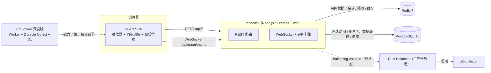

# 架构总览

本文描述 OpenTogetherTube 中文版（本仓库）**当前实现**的架构：进程与组件、运行时数据流、
同步引擎、服务端与客户端内部结构、数据与配置、测试与发布流程。面向想深入代码的贡献者与运维者；
"改哪里、有哪些坑"的速查版见配套的 [AI 工作手册](./ai-handbook.zh-CN.md)。

**版本快照**：`feat/upscale-quality` @ `ebace39`（v1.2.6 标签后一个 balancer 清理提交，
2026-09-30；写作时 `origin/main` 同点）。涉及具体行为时以工作区代码为准。

---

## 1. 定位与边界

一个实时视频同步 Web 应用：一群人通过浏览器"同看"同一批媒体，房间共享播放状态、队列、
聊天、便签与权限体系。本仓库是上游 [OpenTogetherTube](https://github.com/dyc3/opentogethertube)
`v0.15.0` 的简体中文分支（来源与移植范围见 [UPSTREAM.md](../UPSTREAM.md)），默认简体中文、
免注册开房，重点工程投入在**同步边界情况**与**浏览器内画质增强**。

系统边界：

- **不托管、不转码、不代理媒体**。播放源是第三方直链（MP4/HLS/DASH/自定义清单）或平台的
  iframe 嵌入；画质增强整条链路在客户端（WebGPU/WebGL2），**服务器不需要 GPU**。
- **单实例是完整的部署形态**。Rust 负载均衡器设计完备但在本分支生产未启用（§9），
  多机扩展是"备而不用"的能力。
- **Cloudflare 预览版是能力子集**：无账号体系、无语音、无 SponsorBlock 等，见 §10。

---

## 2. 系统总览



**组件一览：**

| 组件 | 位置 | 技术栈 | 职责 |
| --- | --- | --- | --- |
| 客户端 | `client/` | Vue 3.5 + **Vuex 4**（非 Pinia）+ Vuetify 3 + vue-i18n + vue-query | SPA、播放器、同步纠偏、画质增强、聊天/便签/语音 UI |
| 服务端（Monolith） | `server/` | TypeScript + Express + Sequelize + `ws`（原生 WebSocket）+ winston + prom-client | REST API、WebSocket 房间、权威时钟、信息提取、持久化 |
| 共享层 | `common/` | TypeScript | 消息协议与 Zod 校验、权限、异常、时间计算、结果类型 |
| Rust 层 | `crates/*` | Rust（hyper/tungstenite/Rocket） | 负载均衡器、协议、collector、集成测试框架（生产未部署） |
| 边缘预览 | `packages/ott-edge` | Cloudflare Worker + Durable Object + D1 | 无服务器子集实现 |
| 监控面板 | `packages/ott-vis*` | React + D3 + Grafana SDK | 自研 Grafana 面板/数据源插件 |
| 部署 | `deploy/`, `docker/` | Docker Compose | 镜像构建、迁移、资源限制、备份、TLS |

---

## 3. 仓库结构

```text
client/            Vue 3 前端（Vite；src/{components,stores,util,views,plugins,locales}）
server/            Express monolith（api/、auth/、services/、storage/、models/、migrations/、tests/）
common/            前后端共享 TS（models/messages.ts 为消息协议；permissions/exceptions/timestamp…）
crates/            Rust workspace：ott-balancer(-bin/-protocol)、ott-collector、ott-common、harness(-tests)
packages/          ott-edge（Cloudflare 预览版）+ ott-vis / ott-vis-panel / ott-vis-datasource（Grafana）
db/                仅本地 SQLite 产物；真正的迁移在 server/migrations/
deploy/            生产部署：init.sh、next-compose.yml、next.Dockerfile、备份脚本、上游遗留的 Fly/Ansible 资产
docker/            本地开发 compose（含 with-balancer 变体）与构建用 Dockerfile
env/               配置模板（example.toml、balancer.example.toml；实际 *.toml 不入库）
scripts/           codegen.sh（typeshare 生成）、anime4k GLSL 转换器、版本号脚本
tests/             Cypress E2E 与 k6 负载脚本（单元测试在各 workspace 内）
docs/              中文专题文档（本文件所在处）
```

---

## 4. 运行时数据流

### 4.1 HTTP 请求生命周期（`server/app.ts`）

中间件顺序（有意安排）：

1. **指标**：`metricsMiddleware`（所有请求计数/耗时）。
2. **安全响应头**：`installSecurityHeaders`（含 report-only CSP 与 `/api/csp-report` 端点，先于会话/静态资源）。
3. **Cookie 解析**。
4. **静态客户端文件**：先于会话中间件挂载，避免为静态资源创建会话。
5. **express-session**（Redis store）：cookie 名可配置，`sameSite=lax`，生产 + 非 localhost + `trust_proxy>0` 时 `secure`；
   `FORCE_INSECURE_COOKIES=true` 可强制关闭（裸 IP/HTTP 部署用）。
6. **passport**：Local / Discord / Bearer 三种策略；Bearer 只接受已登录 token。
7. **WebSocket 与房间循环启动**：`websockets.setup(server)` → `clientmanager.setup()` → `roommanager.start()`。
8. **Body 解析**（仅 API 需要）。
9. **请求日志**（仅 `/api/*`，跳过 `/api/status`）。
10. **API 路由** `/api`，随后是 **SPA 兜底**。
11. `initExtractor()` → `server.listen(port)`。

优雅停机：踢掉全部 WebSocket 客户端 → 等 1s → `roommanager.shutdown()`（卸载全部房间、flush 快照）→ 退出。

### 4.2 WebSocket 连接与加入房间

- 客户端连接 `ws(s)://<host>/api/room/<name>[?reconnect=true]`。
- **首消息必须是 `auth`**：10 秒内未完成认证即被踢（`OttWebsocketError.MISSING_TOKEN`）；
  token 来自 Redis 会话（`auth:<token>`），最长 1024 字符（真实 token 约 684 字符）。
- 认证后客户端发 `JoinRequest`；服务端先回一条完整 `sync`（权威状态），再按需补发便签与语音名单。
- `connected` 语义：客户端在**收到第一条 `sync`** 时才认为连接成功（见 §7.3）。
- 心跳：服务端每 10s 扫一遍连接，`isAlive` 为 false 直接 `terminate()`，否则发 WS ping；收到 pong 置 alive。
- 应用层延迟探测：客户端每 15s 发 `{action:"ping", t0}`，服务端回 `pong`（每连接限 1 次/秒）。
- 消息尺寸：`maxPayload = 256 KB`；聊天/标题/描述在 WS 层有独立长度上限。
- 每连接令牌桶（v1.2.6 加入）：通用 40 突发 / 10 每秒，聊天 5 突发 / 0.5 每秒；超限回 `error` 消息而不掉线。

### 4.3 一条「暂停」命令的旅程

1. 客户端 `RoomApi.pause()` → WS `{action:"req", request:{type:PlaybackRequest, state:false}}`
   （`client/src/util/roomapi.ts`）。
2. `clientmanager` 校验（Zod → 房间请求白名单）→ `room.processUnauthorizedRequest()`（`server/room.ts`）。
3. 权限判定（`RoomRequestType → 权限名` 映射）后调用 setter：`isPlaying = false` → `markDirty("isPlaying")`。
4. **50ms debounce** 的 `throttledSync()` 合并突发变更；`sync()` 由 Mutex 串行，`syncDirty()` 只序列化脏字段，
   广播 `ServerMessageSync`；脏集合在 I/O 前快照并清空，失败时回滚重试。
5. 持久化侧：Redis 快照 **5s debounce**（`room:<name>`，TTL 7200s）；永久房间另同步写 Postgres。
6. 各客户端 `ServerMessageHandler` → Vuex `room/sync` mutation → 重算播放锚点（减去单程延迟）。
7. `views/Room.vue` 收到 sync 后 `applyIsPlaying()` 实际暂停播放器；每 250ms 的 `playbackSync.tick()`
   持续把本地播放器纠偏到房间时钟（§5.4）。

---

## 5. 同步引擎

### 5.1 服务端权威时钟

房间播放状态由三个量决定：`_playbackStart`（锚点，`dayjs`）、`_playbackPosition`、`_playbackSpeed`。
`realPlaybackPosition` = 播放中则按锚点外推，暂停则冻结——**广播的永远是"此刻的位置"**，客户端拿绝对锚点
自行外推（`common/timestamp.ts:calculateCurrentPosition`）。

### 5.2 状态的四种投影（`server/room.ts`）

同一份房间状态按用途投影，这是安全边界的一部分：

| 投影 | 去向 | 包含 | 明确排除 |
| --- | --- | --- | --- |
| `RoomState` | 服务端内存 | 全部 | — |
| `RoomStateSyncable` | **广播给客户端** | 标题/队列/播放状态等 | owner、votes、userRoles、users、resumeOnNextJoin |
| `RoomStateStorable` | **Redis 快照** | 可恢复播放所需 | hasOwner、votes、users、临时倍速、playbackPreparation；owner 只留 id（绝不落密码材料） |
| `RoomStatePersistable` | **Postgres（永久房间）** | 仅设置类字段 | 播放进度、队列（队列快照存 `prevQueue` 字段） |

新增需要同步/持久化的字段时，必须显式加进对应投影的 `*Props` 列表，否则不会被广播或保存。

### 5.3 脏字段广播与持久化

- 每个 setter → `markDirty(prop)` → 50ms debounce `sync()`；`sync()` 用 Mutex 防 debounce 与 1s tick 交错。
- 广播只包含脏字段（增量 `sync`），客户端按字段逐项应用。
- Redis：storable 脏字段触发 5s debounce 保存；房间卸载时 flush；写失败只记日志，脏集合保留待下次重试
  （v1.2.6 修复了"Redis 写失败变成未捕获 rejection"）。
- Postgres：仅永久房间，脏设置变化时 `storage.updateRoom()`。
- 1s tick（`roommanager.runUpdate`，带单飞守卫）：`room.update()`（缓冲门、保活、出队、投票排序、SponsorBlock）
  + `room.sync()`；超过 `room.unload_after`（默认 300s）无活动的房间被卸载。

### 5.4 客户端纠偏状态机（`client/src/util/playback-sync.ts`）

每 250ms 一拍；核心是"能改速率就用速率收敛，不能改才跳"：

| 常量 | 值 | 含义 |
| --- | --- | --- |
| `BEND_START` / `BEND_STOP` | 0.3s / 0.15s | 进入/退出微调的迟滞死区 |
| `BEND_FULL` | 0.5s | 漂移达到该值时速率修正拉满 |
| `MAX_BEND` | ±8% | 温和微调上限（可 bend 的播放器） |
| `CATCHUP_MAX_BEND` | ±15% | 1–3s 漂移时的追赶区上限 |
| `HARD_SEEK_DRIFT` | 3s（不可 bend 时 1s） | 硬跳阈值 |
| `BEND_DEADLINE_MS` / `MAX_BEND_DEADLINE_MS` | 8s / 30s | 收敛期限，超期回退硬跳 |
| seek 冷却 | 2s；上次 seek 后有缓冲则 8s | 防 seek 风暴 |
| `RATE_WRITE_THRESHOLD` | 0.002 | 速率写入死区 |
| `LATENCY_PROBE_INTERVAL_MS` | 15s | ping 间隔 |
| 单程延迟 | 最近 8 个样本的 `min(RTT)/2`（>5s 丢弃、>180s 老化） | 锚点前移量 |

**能力分层**：Direct / HLS / DASH 是原生 `<video>`，可写 `playbackRate` → 支持速率微调；
YouTube / Vimeo / PeerTube / Bilibili 只能 seek。纠偏层通过 `supportsRateBend()` 运行时探测。

### 5.5 三个配套机制

- **首帧对齐**（`playback-preparation.ts` + 服务端 `holdPlaybackForPreparation`）：换片/出队/立即播放时，
  房间先停在新视频片头，选一名有播放权限的观众 prime，客户端确认 `ready` 且位置误差 ≤1s 后才 `play()` 并启动时钟；
  从数据库恢复的房间保持"无播放意图"，进入房间不会自动开播。
- **媒体恢复**（`media-recovery.ts`）：网络错误 1s/3s/6s 三次重试，解码错误一次；卡顿阶梯 = 重载 → +0.3s 跳转 → +3s 跳转（超时 8s 触发）。
- **seek 语义**（`media-seek.ts`）：50ms 容差，先暂停再写 `currentTime`，`readyState ≥ 2` 且位置收敛才算完成。

### 5.6 缓冲联动（房间设置，可选）

`bufferGateMode=pause` 且房间内 ≥2 名有播放权限的观众时，有人明确上报 `buffering` 则全房间暂停等待：
上限 `BUFFER_GATE_MAX_WAIT_MS=15s`、启动宽限 2s、冷却 30s；后台标签页不算等待方。详见
[buffer-gate.zh-CN.md](./buffer-gate.zh-CN.md)。

---

## 6. 服务端

### 6.1 API 面（`server/api.ts` + `server/api/*`）

| 路由组 | 内容 | 鉴权 |
| --- | --- | --- |
| `/api/status` | 健康、版本（`/version`，no-store）、指标（`/metrics`）、语音用量（`/voice`） | 公开；metrics/voice 需 loopback 或 apikey |
| `/api/playback` | 匿名播放质量遥测 `POST /quality` | 公开（进程内限速 5s/次） |
| `/api/auth` | `GET /grant`（游客 token）、Discord OAuth | 公开 |
| `/api/data` | `GET /previewAdd`（URL/搜索解析） | 公开 |
| `/api/user` | whoami、改名、登录/登出/注册、密码找回、账号管理、owned-rooms | token |
| `/api/room` | 列表、生成、创建、查询/改设置/删除、undo、vote、queue | token（列表的 apikey 可选） |
| `/api/announce` | 全局公告 | apikey |
| `/api/dev` | 测试辅助端点 | 仅 `env=development` 挂载 |

### 6.2 WebSocket 层

- 原生 `ws`（`noServer` + HTTP `upgrade`）+ `server/clientmanager.ts` 路由；帧级 Zod 校验（`server/ws-schemas.ts`）。
- 客户端 → 服务端消息：`auth`、`kickme`、`status`（播放状态 + 首帧确认）、`notify`、`req`（房间请求）、
  `voice`、`signal`、`ping`。
- 服务端 → 客户端消息：`sync`、`user`、`you`、`notes`、`event`、`eventcustom`、`chat`、`announcement`、
  `voice`、`signal`、`pong`、`error`、`unload`。
- **房间请求白名单**：内部请求类型（如 UpdateUser 的成员变更路径）不可由客户端直接发起。
- 请求失败以 `error` 消息返回而不断连；`MissingToken` 等才踢。

### 6.3 房间引擎

- `server/room.ts` 持有状态、setter、权限映射与全部请求处理（`processUnauthorizedRequest` → `processRequest`）。
- 权限：`common/permissions.ts` 28 个权限位 + 角色继承（Owner/Administrator/Moderator/TrustedUser/
  RegisteredUser/UnregisteredUser）；投票跳过阈值 = `ceil(人数 × 0.5)`（仅计有 `playback.skip` 的用户）。
- 生命周期：内存 → Redis 快照（崩溃恢复播放进度）→ Postgres（永久房间设置）；房间懒加载，重启不恢复风暴。
- 永久房间每次设置变更落库，且只有永久房间允许便签；临时房间不碰 Postgres。
- `roommanager` 用 EventEmitter 总线（`publish`/`command`/`load`/`unload`）与传输层解耦；
  `INCR roommanager:load_epoch` 为多机场景提供全局装载序号（balancer 用）。

### 6.4 认证、限流

- **token**：`crypto.randomBytes(512)` 的 base64（不透明，无 JWT）；Redis `auth:<token>` 存会话；
  游客 14 天、登录 240 天；登录/注册/Discord 回调/密码重置都会**轮换 token**（防会话固定）。
  httpOnly cookie 与 Bearer 双通道；游客昵称由中文昵称生成器生成。
- **全局限流**：`rate-limiter-flexible`，1000 点/小时/IP，超限封 120s；按端点扣点（建房 50/200、
  队列 5（批量 ×3/视频）、搜索 5/75、`auth/grant` 20、注册 100、密码找回 100/10、账号 10、CSP 25）。
- **登录爆破**：IP 维度 100 次失败/24h（封 24h）+ 用户名×IP 维度 10 次连续失败（封 1h，成功清零）。
- API key 校验用 `timingSafeEqual`（`server/admin.ts`）。

### 6.5 信息提取与媒体源适配器

`server/infoextractor.ts` 管线：**DB 缓存（CachedVideos）→ Redis 搜索缓存 → 适配器抓取**；
只补 `missingInfo` 缺的字段；`OutOfQuotaException` 时尽量返回部分缓存。

13 个适配器（`server/services/`）：`youtube`、`invidious`（YouTube 代理）、`vimeo`、`peertube`、
`bilibili`、`reddit`、`tubi`、`pluto`、`odysee`、`googledrive`、`direct`、`hls`、`dash`。

- 缓存：视频字段在 `CachedVideos`；标题/描述/缩略图/时长在"视频较新（≤7 天）时保鲜 7 天、否则 30 天"，
  `mime` 永久返回；搜索缓存 24h；`previewAdd` 响应缓存 1h（cache-safe 服务 7 天）。
- `isCacheSafe=false`（不写缓存）：pluto、bilibili、reddit、tubi、direct、hls、dash。
- YouTube 走 Data API v3，配额耗尽有网页解析 fallback；Invidious 探测 DASH/HLS 清单选高码率，失败回退渐进流。
- 防盗链探测（`services/media-access.ts`）：先用本应用 origin 的 Referer 探测首个分片，被拒再试无 Referer，
  实测可播才记录 `referrerPolicy:"no-referrer"`。

### 6.6 直链探测（`server/ffprobe.ts`）

三种策略（`info_extractor.direct.ffprobe_strategy`）：`run`（默认，把 URL 直接交给 ffprobe，Range 读取）、
`stream`（自行下载字节流入管道）、`disk`（下载到临时文件）。统一 20s 硬超时、最多 5 次重定向；
每次重定向都过一次 SSRF 私网地址检查（已知缺口：`run` 路径的 DNS rebinding，见修复报告）。
HLS/DASH 不走 ffprobe，分别用 `m3u8-parser` / `dash-mpd-parser` 解析清单。

### 6.7 存储

**Redis**（`server/redisclient.ts`；5s 连接/命令超时、关闭离线队列）：

| Key | 用途 | TTL |
| --- | --- | --- |
| `room:<name>` | 房间快照（`RoomStateStorable`） | `room.expire_after`（默认 7200s） |
| `room-sync:<name>` | 多机同步通道遗留键，现在只会在卸载时删除 | — |
| `roommanager:load_epoch` | 全局装载序号（balancer 用） | 无 |
| `search:<service>:<query>` | 搜索结果缓存 | 24h |
| `segments:<videoId>` | SponsorBlock 分段 | 7 天 |
| `ytchannel:<k>:<v>` | YouTube 频道→播放列表缓存 | 无 |
| `auth:<token>` | 会话 token | 游客 14 天 / 登录 240 天 |
| `accountrecovery:<key>` | 密码找回验证码 | 600s |
| `voice:relay-bytes:<YYYY-MM>` | 语音中继月度用量 | 62 天 |
| `announcement`（pub/sub 频道） | 全局公告扇出 | — |

**Postgres**（Sequelize；迁移在 `server/migrations/`，当前 22 个）：

| 模型 | 表 | 关键内容 |
| --- | --- | --- |
| `Room` | `Rooms` | 永久房间：name/title/description/visibility/queueMode/ownerId/permissions JSONB/role-* 列/prevQueue 等 |
| `User` | `Users` | username/email（唯一）、argon2 salt/hash、discordId |
| `CachedVideo` | `CachedVideos` | (service, serviceId) 唯一；title/description/thumbnail/length/mime |
| `RoomNote` | `RoomNotes` | 追加式便签：roomName/authorName/authorId/text |

存储层在 `server/storage.ts` + `server/storage/*`；房间名匹配用 `lower(name)`；`Grants` ↔ JSONB 转换。
本地开发/测试用 SQLite（`server/db/*.sqlite`），CI 同时跑 SQLite 与 Postgres 两条路径。

### 6.8 配置、观测与错误

- 配置加载：`env/base.toml` → `env/<env>.toml`（`<env>` 取 `NODE_ENV`），可选叠加
  `heroku.base.toml` / `docker.base.toml`；schema 在 `server/ott-config.ts`（convict），支持环境变量覆盖；
  严格校验要求 `session_secret` ≥80 字符、`api_key` ≥40 字符。
- 主要配置段：`db`、`redis`、`add_preview.search`、`info_extractor.*`、`rate_limit`、`voice.*`、
  `room.{unload_after,expire_after,enable_create_*}`、`video.sponsorblock`、`balancing.*`、`mail`、`discord`。
- 指标（prom-client）：HTTP 请求/耗时/错误、DB、Redis、房间数/人数、房间 tick 耗时/跳过、WebSocket 关闭码、
  语音用量；`GET /api/status/metrics` 暴露。
- 日志：winston，命名空间 + 房间上下文，级别可配；v1.2.6 起进程级 `unhandledRejection` 兜底只记日志。
- 错误：`common/exceptions.ts` 的 `OttException` 为根，服务端另有约 30 个子类（`server/exceptions.ts`）；
  路由各自持 errorHandler，把 `OttException` 映射为 4xx，其余 500 `{name:"Unknown"}`。

---

## 7. 客户端

### 7.1 启动与路由

`main.ts` 依次装载 Vuex、vue-router、vue-query、i18n、Vuetify、连接插件、音效插件；生产构建额外安装
版本更新检查（每 120s 轮询 `/api/status/version`，见 §7.8）。所有路由懒加载（`client/src/router.ts`）：
首页、房间列表、我的房间、账号、`/room/:roomId`（核心）、帮助、归属页、密码重置、404；`/r/:id` 与
`/rooms/:id` 重定向到房间。**没有鉴权路由守卫**。

### 7.2 状态（Vuex 模块）

| 模块 | 职责 |
| --- | --- |
| 根状态 | `playerStatus`、缓冲、登录态、全屏、公告/错误 toast |
| `room` | 房间状态镜像；`SYNC` mutation 应用增量 sync，重算 `playbackStartTime`（减去单程延迟） |
| `users` | 房间成员 Map、`you.id`、token（localStorage）；`getNewToken` 单飞 |
| `settings` | 客户端设置持久化到 `localStorage["settings"]`；`UPDATE` 持久 + 应用，`UPDATE_TRANSIENT` 仅本次会话（自动降档用） |
| `events` | 把房间事件映射为本地化 toast |
| `notes` | 房间便签数组与上限 |
| `toast` | 通知队列（合并连续播放/seek 事件） |
| `misc` | 建房 loading 等杂项 |

设置读入时做版本迁移（如 locale 版本变化重置为 zh-CN）。vue-query 目前只用于账号页。

### 7.3 连接服务（插件注入，不在 store 里）

`client/src/plugins/connection.ts` 提供 `OttRoomConnectionReal`（测试用 Mock）：

- 重连：**线性退避** `min(30s, (1s + 2s×次数)) × (0.5–1.5 随机)`，不是指数退避；`?reconnect=true` 跳过首次加入语义。
- `connected` 在收到第一条 `sync` 时置真；`active` 表示"应当连接"。
- 关闭码 ≥4000 为服务端踢出（未知码可重试 2 次）；`<4000` 视为网络问题并重连。
- 延迟探测：每 15s `ping`，服务端回 `pong`；样本保留 8 个，取 `min/2` 作为单程延迟。

### 7.4 消息处理与回流

`components/ServerMessageHandler.vue` 把服务端消息映射到动作：
`sync→room/sync`、`user→users/user`、`you→users/you`、`notes→notes/notes`、`event(custom)→events`、
`error→根 error`、`announcement→根 announcement`；
`WorkaroundPlaybackStatusUpdater.vue`（防抖 200ms）上报播放状态（`status`），
`WorkaroundUserStateNotifier.vue` 上报改名（`notify`）。

### 7.5 Room.vue 与 250ms 循环

`views/Room.vue`（约 2468 行）是房间编排器：连接、RoomApi、播放器 composable、播放同步/首帧准备/
媒体恢复/画质上报、语音、手势、快捷键、全屏、聊天/队列/便签/设置等全部在此接线。
每 250ms 的 `setInterval` 更新真实位置、Media Session、下一集预取、首帧准备与 `playbackSync.tick()`。
播放器事件 → `applyIsPlaying()`/`applySeek()`；服务端 sync → 重算锚点再应用。

### 7.6 播放器抽象

接口 `client/src/components/composables/media-player.ts`（能力用可选方法做运行时探测）：

| 组件 | 封装 | 速率微调 | 字幕 | 画质档 |
| --- | --- | --- | --- | --- |
| `DirectPlayer` | 原生 `<video>` | ✅ | ✅ | Safari `videoTracks` |
| `HlsPlayer` | hls.js / 原生 | ✅ | ✅ | ✅（levels） |
| `DashPlayer` | dash.js | ✅ | ✅ | ✅ |
| `YoutubePlayer` | YouTube iframe API | ❌ | ✅ | 有限 |
| `VimeoPlayer` | @vimeo/player | ❌ | ✅ | ❌ |
| `PeertubePlayer` | PeerTube embed API | ❌ | ❌ | ❌ |
| `BilibiliPlayer` | 官方 iframe | ❌ | ❌ | ❌ |

`OmniPlayer.vue` 按 `source.service` 分发（sourceKey 变化强制重载）；Direct/HLS/DASH 接入 `UpscaleLayer`。

### 7.7 画质增强（全部在客户端）

档位：`off` / `sharpen`（清晰化）/ `film`（影视）/ `anime4k`（AI 快速）/ `anime4k-quality`（AI 质量）/
`anime4k-ultra`（极致，仅无 WebGPU 设备显示）。渲染器选择在 `components/players/UpscaleLayer.vue`：

| 档位 | 实现 | 说明 |
| --- | --- | --- |
| 清晰化 | WebGL2 + FSR1 EASU/CAS（`util/upscale/cas.ts`） | 12 抽头边缘自适应放大 + 对比自适应锐化 |
| 影视 | WebGL2（`film.ts`） | 保边去噪去块 → 压平色带 + 抖动 → EASU → 0.6 系数锐化 |
| AI 快速/质量 | WebGPU（`anime4k.ts`，anime4k-webgpu 的 ModeA / A+A） | 拿不到 WebGPU 时质量档改走 WebGL2 A+A 链 |
| AI 极致 | WebGL2（`anime4k-ultra.ts`，55 段，2× 下 46 pass） | 官方 Anime4K v4.0.1 GLSL 逐字生成，与 mpv A+A (HQ) 对齐 |

- 尺寸与倍率：`scale.ts` 统一计算画布；autos 跟随显示盒，仅 CNN 档有 1.25× 下界；
  电脑（指针设备）默认按 2× 源分辨率渲染，触屏贴合显示尺寸。
- WebGPU 探针（`webgpu-probe.ts`）真正跑一遍存储纹理读写 + 视频上传校验，只有确证不支持才排除 WebGPU 档；
  失败不缓存。
- 性能与降档：渲染目标池化复用、程序按 GL 上下文缓存；自动降档按 档位 → 倍率（下限 `min(1, 显示盒倍率)`）→ 关闭 的阶梯，
  降档只影响本次会话（`settings/UPDATE_TRANSIENT`）。
- 生成物 `anime4k-glsl.ts` / `anime4k-ultra-glsl.ts` **不要手改**，由
  `scripts/anime4k-glsl-to-webgl2.mjs` + `.sh` 从官方 GLSL 生成（Biome 已排除这两个文件）。

### 7.8 i18n 与构建

- i18n：默认 `zh-CN`、回退 `en`（两者立即加载），其余语言（de/es/fr/pirate/pt-br/ru）按需动态 import；
  切换语言同时更新 `Accept-Language`。非中英语言目前普遍缺数百个键（已知项）。
- 构建（`client/vite.config.js`）：Vite；`hls.js`/`dashjs`/`three`/`anime4k-webgpu` 保持异步分块（动态 import），
  其余依赖进 `vendor`；生产剥离 `console.log/info`；dev server 8080 代理 `/api` 到 3000（含 WS）。
- 更新检查：`util/client-update.ts` 每 120s + `pageshow/online/visibilitychange` 拉 `/api/status/version`，
  比对 revision（git hash 或 `cloudflare-preview-N.N.N`），提示刷新且避免打断输入。

---

## 8. 共享层 `common/`

- `models/messages.ts`：全部 WS 消息类型（服务端→客户端 13 种、客户端→服务端 8 种、房间请求 23 种），
  是前后端协议的唯一定义；服务端另有 Zod 校验 `server/ws-schemas.ts`。
- `permissions.ts`：28 个权限位、角色继承、`Grants` 序列化（始终强制 Owner/Administrator 全权限）。
- `exceptions.ts`：`OttException` + 权限/角色/token 三个基础异常；服务端子类在 `server/exceptions.ts`。
- `timestamp.ts`：`calculateCurrentPosition(start, now, offset, speed)`——全系统位置外推的唯一公式。
- `result.ts`：`Ok/Err` 风格 `Result<T,E>` 与 `intoResult/intoResultAsync`。
- `constants.ts`：服务列表、房间名正则、便签/缓冲门/临时倍速等共享常量。
- `nicknames.ts`：中文游客昵称生成。
- 导入约定：服务端引用带 `.js` 扩展名；client 引用不带；`exports` 默认解析原始 TS，生产镜像用
  `--conditions=lean` 走 `ts-out/` 编译产物。

---

## 9. Rust 层（设计完备，生产未启用）

| crate | 职责 |
| --- | --- |
| `ott-balancer` | 核心负载均衡器：hyper HTTP + WS 升级、单 dispatcher actor、选点策略、房间路由、HTTP 代理 |
| `ott-balancer-bin` | 二进制入口（harness 用它拉起真实进程） |
| `ott-balancer-protocol` | 双端协议类型；`typeshare` 生成 `server/generated.ts`（CI 校验漂移） |
| `ott-common` | 服务发现（Dns/Fly/Manual/Harness）与 WS 升级工具 |
| `ott-collector` | Rocket 服务：轮询各 balancer `/api/state` + 订阅事件流，只观测不参与路由 |
| `harness` / `harness-tests` | 集成测试框架：真实 balancer 进程 + 模拟 monolith/client，覆盖路由/重复加载/重启/区域优先 |

- 选点策略：同 region 优先 → `MinRooms`（默认，按房间数）/ `HashRing`（生产配置，粘性）/ `Random`。
- 房间首访时选点并 `Join`，monolith 自行加载；重复加载用 Redis `load_epoch` 裁决（小者被 `B2MUnload`，大者接管）。
- Monolith 侧：`server/balancer.ts`，`BALANCING_ENABLED=1` 时监听 `BALANCING_PORT`（默认 3002）。
- **生产状态**：本分支的 `deploy/next-compose.yml` 不含 balancer/collector；
  仅在 `docker/with-balancer.docker-compose.yml`（开发/演示）中一起构建运行。
- 运行方式（参考）：`cp env/balancer.example.toml env/balancer.toml` →
  `cargo run -p ott-balancer-bin -- --config env/balancer.toml`；配置也支持 `BALANCER_*` 环境变量。
  v1.2.6 起全局配置用 `OnceLock`，唯一可变的 region 用 `RwLock` 包装。

---

## 10. Cloudflare 预览版（`packages/ott-edge`）

无需服务器的能力子集：Worker 静态资源（`client/dist`，SPA 兜底）+ `/api/*` 路由；
**Durable Object `RoomObject`** 持有房间与 WebSocket（hibernation-safe、`setWebSocketAutoResponse("ping","pong")`），
D1 存身份/房间索引/媒体缓存/限流，`MaintenanceObject` 每 6h 清理过期数据（替代 Cron）。

- 支持：永久/临时房间、公开房间列表、昵称与权限、踢人、MP4/HLS/DASH/自定义清单直链、同步播放/聊天/队列/投票、恢复。
- 不支持：账号登录、跨浏览器身份、DJ 模式、SponsorBlock、undo、语音。
- 限制：每房间 100 连接、每身份 4 连接、每身份 20 房间、单消息 64KB、队列 ≤200 项、媒体解析 2MiB/16 请求。
- 配额与费用见 [cloudflare-quotas.zh-CN.md](./cloudflare-quotas.zh-CN.md)，部署见
  [DEPLOYMENT-CLOUDFLARE.md](../DEPLOYMENT-CLOUDFLARE.md)。

---

## 11. 测试、CI 与发布

**测试布局**（截至本文快照）：

| 位置 | 规模 | 运行 |
| --- | --- | --- |
| `server/tests/unit/**` | 47 个 `*.spec.ts`（+1 类型测试） | `yarn workspace ott-server test`（需 `NODE_ENV=test` 与已迁移的测试库） |
| `client/tests/unit/**` | 69 个 `*.spec.ts`（+3 个旧 `.js`） | `yarn workspace ott-client test`（脚本已带 `NODE_ENV=test`） |
| `common/tests/unit/**` | 7 个 `*.spec.ts`（+1 类型测试） | `yarn workspace ott-common test` |
| `tests/e2e/integration/*.spec.ts` | 9 个 Cypress 用例 | `yarn cy:run`（本地运行，**不在 CI**；含上游英文选择器） |
| `crates/**` | Rust 单元 + harness 集成测试 | `cargo test` |
| `tests/load/*.js` | 7 个 k6 脚本 | `k6 run <script>`（需手动准备房间） |

单文件用例：`yarn workspace ott-server exec vitest run tests/unit/room.spec.ts`（client/common 同理）。

**CI（`.github/workflows/`）**：

- `main.yml`：Node 22/24/26 矩阵；`lint-ci`（Biome + Prettier .vue + 各 workspace lint）；
  `scripts/codegen.sh` 后 `git diff --exit-code` 校验 typeshare 生成物漂移；SQLite 与 Postgres 两条测试路径；
  typos；Grafana 插件兼容检查。`docs/**`、`env/**`、`*.md` 的改动不触发。
- `rust.yml`：Rust 1.84，fmt/check/clippy/doc/test。
- `codeql-analysis.yml`：JS/TS 静态分析。
- `publish-image.yml`：推送 `v*` 标签触发，构建并推 `ghcr.io/g1157/opentogethertube-cn:<tag>` 与 `:latest`。

**发布流程**：本地打 `vX.Y.Z` 标签并推送 → Actions 构建镜像 → 服务器拉取新镜像（改 `.env` 的
`OTT_IMAGE`）→ 先在 18080 验收、同一镜像晋升 8080；回退 = 改回旧 tag + `up -d --no-deps`。
版本记录在[version-notes.zh-CN.md](./version-notes.zh-CN.md)。

---

## 12. 部署与运维

`deploy/init.sh` 生成 `compose.yml`、`backup.sh` 与 `.env`（随机密钥；拒绝覆盖已有 `.env`）。
`deploy/next-compose.yml` 四容器：

| 服务 | 镜像 | 限额 | 说明 |
| --- | --- | --- | --- |
| `migrate` | 应用镜像 | — | 幂等迁移，成功后应用才启动 |
| `ott` | `${OTT_IMAGE}` | 512m / 1 CPU，read_only，cap_drop ALL，仅绑 127.0.0.1 | Node 堆 384MB；健康检查 `/api/status` |
| `postgres` | `postgres:15-bullseye` | 384m | `shared_buffers=64MB`、`max_connections=50` |
| `redis` | `redis:7-alpine` | 192m | AOF everysec、`noeviction`、必须密码 |

容量起点 2 vCPU / 2 GiB（总内存上限约 1.06 GiB）；备份 `backup.sh`（pg_dump，保留 14 份，systemd 定时器模板）；
TLS 可选 Cloudflare Tunnel（`TRUST_PROXY=1`）或裸 IP 的 Caddy + ACME shortlived 证书。详见 [DEPLOYMENT.md](../DEPLOYMENT.md)。

---

## 13. 扩展指南

| 想做什么 | 改动位置 |
| --- | --- |
| 新增媒体源适配器 | `server/services/<name>.ts` 继承 `ServiceAdapter`；`server/infoextractor.ts` 注册；`common/constants.ts` 的 `ALL_VIDEO_SERVICES`；`info_extractor.services` 允许列表；播放器侧如需嵌入则加 `client/src/components/players/*` 并在 `OmniPlayer.vue` 分发；服务端测试放 `server/tests/unit/services/` |
| 新增 WS 消息 | `common/models/messages.ts` 联合类型 → 客户端消息加 `server/ws-schemas.ts` 与 `clientmanager` 路由；服务端消息加 `ServerMessageHandler.vue` 映射与 store mutation |
| 新增房间设置 | `common/models/types.ts` + `zod-schemas.ts` → `server/room.ts`（字段、setter、投影列表、`applySettings`）→ `RoomSettingsForm.vue` → 双语文案 |
| 新增权限 | `common/permissions.ts`（`PERMISSIONS` 位 + 默认授予）；如需回填历史房间，加迁移 |
| 调整同步算法 | `client/src/util/playback-sync.ts` + 单测；同步更新 [playback-sync.zh-CN.md](./playback-sync.zh-CN.md) |
| 新增画质增强档 | `client/src/util/upscale/*` + `stores/settings.ts`（`UPSCALE_MODES`）+ `VideoSettings.vue` + `UpscaleLayer.vue` 选择与降档阶梯 + [video-enhancement.zh-CN.md](./video-enhancement.zh-CN.md) |
| 数据库变更 | `server/migrations/YYYYMMDDHHMMSS-描述.js` + 模型；`yarn db:migrate`；在版本记录中注明 |
| 新增界面语言 | `client/src/locales/<lang>.ts` + `i18n.ts`/语言选择器；参考 [how-to-add-new-language.md](./how-to-add-new-language.md) |
| 修改部署 | `deploy/`（见其 README）；改完在 18080 验收再晋升 |

---

## 14. 关键文件索引

| 关注点 | 入口 |
| --- | --- |
| 同步引擎（服务端） | `server/room.ts`、`server/roommanager.ts`、`common/models/messages.ts`、`common/timestamp.ts` |
| 同步引擎（客户端） | `client/src/util/playback-sync.ts`、`playback-preparation.ts`、`media-recovery.ts`、`media-seek.ts`、`views/Room.vue` |
| 延迟补偿 | `client/src/util/connection-latency.ts`、`client/src/plugins/connection.ts` |
| WS 传输 | `server/websockets.ts`、`server/client.ts`、`server/clientmanager.ts`、`server/ws-schemas.ts` |
| 认证 | `server/auth/*`、`server/usermanager.ts`、`server/admin.ts` |
| 视频源 | `server/infoextractor.ts`、`server/serviceadapter.ts`、`server/services/*`、`server/ffprobe.ts` |
| 播放器与增强 | `client/src/components/players/*`、`client/src/util/upscale/*` |
| 状态与桥接 | `client/src/store.ts`、`client/src/stores/*`、`client/src/components/ServerMessageHandler.vue` |
| 部署 | `deploy/next-compose.yml`、`deploy/next.Dockerfile`、`deploy/init.sh`、`DEPLOYMENT.md` |
| Rust 层 | `crates/ott-balancer`、`crates/ott-balancer-protocol`、`crates/ott-collector`、`crates/harness` |
| Cloudflare 预览版 | `packages/ott-edge/src/*`、`DEPLOYMENT-CLOUDFLARE.md` |

## 15. 文档地图

- **用户向**：`player-interactions`、`playback-sync`、`buffer-gate`、`player-stats`、`voice`、`room-notes`、
  `media-parsing`、`video-enhancement`、`upscale-*`。
- **运维向**：根目录 `DEPLOYMENT.md`、`DEPLOYMENT-CLOUDFLARE.md`、`deployment-options`、`cloudflare-quotas`、`security-headers`。
- **过程记录**：`version-notes`（逐版本）、`code-review-2026-09-30` / `fix-report-2026-09-30`（审查与修复）、
  `project-overview-2026-09-21`、`adversarial-review-2026-09-21`、两份 `ux-review`。
- **上游遗留（英文）**：`architecture.md`（WIP 概述，本文是其详细替代）、`synchronization.md`、`api.yaml`（REST OpenAPI）、
  `config.md`、`db.md`、`custom-media-format.md`、`how-to-deploy.md`、`how-to-add-new-language.md`。
- **AI 向**：`AGENTS.md`、[ai-handbook.zh-CN.md](./ai-handbook.zh-CN.md)。
