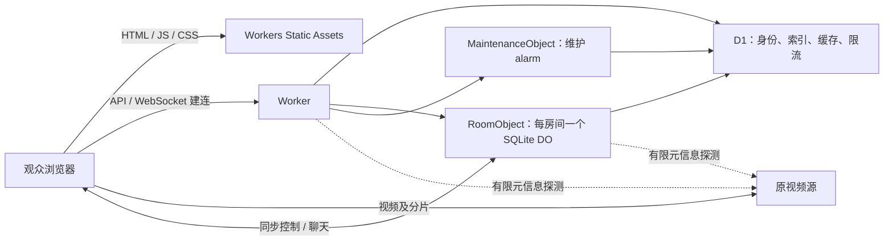

# Cloudflare 免费额度、容量与费用评估

核对日期：**2026-09-10**。适用代码：本仓库 `packages/ott-edge/`，发布标识
`cloudflare-preview-0.1.2`。价格以美元计，未包含税费、域名以及另行购买的服务。
本文分别列出官方限制、实际观测和基于源码的估算；估算不代表压力测试或并发承诺。

## 结论与适用规模

Cloudflare 版可以完全运行在 Workers、Workers Static Assets、SQLite Durable Objects（下文简称 DO）
和 D1 上，无需自有服务器。浏览器直接读取用户提供的视频源，应用只处理页面、控制消息和有限的媒体元信息。
**省去视频中转流量，不等于其他资源无限免费。**

少量朋友、少量房间每天观看几小时，通常是合理的 Free 起步场景。当前测试实例的用量也远低于额度，
但这些额度由**整个 Cloudflare 账户内的应用共享**。公众开放、持续在线、大量房间、频繁操作或不休眠的
DO 都可能先触及某一维度。应用没有“每个站点独享一份免费额度”，新建 Worker 也不会增加账户额度。

- Workers、D1 和 SQLite DO 在 **Free** 上超限会限制相应操作，不会因为超额自动升级成 Paid。
- 在 **Workers Paid** 上，月度包含量之外可能计费；账户最低费用为 $5/月，DO/D1 等按各自维度计算。
- Free 额度不是服务可用性的承诺：单次 CPU、单库大小、并发连接和源站可达性同样会限制请求。
- 预算告警不等于硬性停止计费。项目没有实现一个能够覆盖全部 Cloudflare 产品的自动费用封顶开关。

## 当前架构如何消耗资源



`wrangler.jsonc` 中只有 `/api/*` 配置了 `run_worker_first`。普通页面、SPA 深链接、哈希资源和源码包由
标准 Static Assets 路径响应，不进入 Worker 动态请求计量；不要为了路由方便把全部静态路径都改成
`run_worker_first`。本项目未启用另行计量的 Workers Caching，也未使用 R2、Stream、KV 或 Cloudflare Pages。

| 操作 | 主要计量 |
| --- | --- |
| 打开页面、下载 JS/CSS/源码包 | 当前标准 Static Assets 请求免费；单文件和文件数量仍受限 |
| 取得访客身份 | Worker 请求；D1 身份查找，必要时写入身份与限流记录 |
| 浏览/创建/管理房间 | Worker 请求、D1 查询/限流；创建、检查和控制房间时还可能调用 DO |
| WebSocket 建连 | 一次 Worker 请求、一次 DO 请求，以及 D1 房间查找、限流和认证 |
| 已建立连接上的控制/聊天 | DO 收到的消息、处理时长；状态改变时保存快照，必要时更新 D1 摘要 |
| 页面版本检查 | 可见且未编辑输入框时，约每 30 秒一次 Worker 请求；版本接口本身不查询 D1 |
| 播放中的房间 | 约每 30 秒一次 DO alarm 检查点，保存快照并安排下一次 alarm |
| 空房 | 时钟暂停；临时房到期回收，永久房保留数据，休眠空闲期间不持续计 DO 执行时长 |
| 元信息缓存命中 | D1 读；未命中才读取有限源数据，并写 D1 缓存 |
| 后台清理 | 正常每 6 小时一次维护 alarm；D1 读/删除，必要时调用房间 DO；失败或积压另有重试 |

Worker 的维护调度 Promise 在当前 isolate 内复用；一个新的 Worker isolate 首次处理请求时会调用
维护 DO 检查 alarm。不能假定整个站点生命周期只有一次维护初始化，也不必把它当成每次版本轮询必有一次 D1 写入。

客户端 `Room.vue` 的 250 ms 时间更新是浏览器本地计算，不是每秒 4 次网络请求。当前连接实现不发送
固定频率的应用心跳；DO 的 `ping` → `pong` 自动响应也不意味着每名观众都在定时发送它。
长按临时倍速期间会每秒发送一次续期消息，松手后停止，这类操作需要单独加入预算。

## Free 计划的关键限制

以下是部署和容量评估直接涉及的项目，不是 Cloudflare 全产品限制清单。
日额度按 UTC 日期重置，**00:00 UTC 对应中国标准时间 08:00**；不是从部署时间开始滚动 24 小时。

| 产品 / 维度 | Free 额度或限制 | 本项目的影响 |
| --- | --- | --- |
| Workers 动态请求 | 100,000 次/日/账户 | API、版本检查和 WebSocket 初次升级共享此额度 |
| Worker CPU | 10 ms/次调用 | 网络等待不等于 CPU；解析较大媒体索引仍可能在流量很小时触限 |
| Worker 内存 | 128 MB/isolate | 不是每个观众独占 128 MB |
| Worker 子请求 | 50 次/调用；同时最多 6 条出站连接 | 媒体解析还有更小的应用级预算 |
| Workers 数量 | 100 个/账户 | 一个实例用一个 Worker |
| Cron triggers | 5 个/账户 | 本版本改用 DO alarm，不占用新的 Cron 名额 |
| Static Assets | 20,000 个文件/版本；每文件最多 25 MiB | 当前产物远低于此限；源码包也算一个静态文件 |
| DO 计算请求 | 100,000 次/日/账户 | HTTP/RPC、alarm 与折算后的入站 WS 消息 |
| DO 执行时长 | 13,000 GB-s/日/账户 | 按每对象 128 MB 分配量与可计费执行时长计算 |
| DO SQLite 读 | 5,000,000 行/日/账户 | 包括隐藏 KV 表的 `get/list` 等读取 |
| DO SQLite 写 | 100,000 行/日/账户 | 快照、alarm、删除等；`setAlarm()` 每次计 1 行写 |
| DO SQLite 存储 | 共 5 GB/账户；每对象数据库上限 10 GB | Free 账户总上限会先限制单个大对象 |
| DO 类 | 100 个/账户，实例数无固定上限 | 本实例使用 `RoomObject` 和 `MaintenanceObject` 两个类 |
| DO 单次 CPU | 默认 30 秒，配置最大可至 5 分钟 | 与外层 Worker 的 10 ms 限制不同 |
| D1 读 | 5,000,000 行/日/账户 | 按实际扫描行数，不是返回条数或 SQL 条数 |
| D1 写 | 100,000 行/日/账户 | INSERT、UPDATE、DELETE 及相关索引维护 |
| D1 存储 | 共 5 GB/账户，**每库最多 500 MB** | 本应用只用一个 D1 库，不能按单库 5 GB 规划 |
| D1 数据库数量 | 10 个/账户 | 新部署需有空余数据库名额 |
| D1 语句数量 | 每次 Worker 调用最多 50 条 | 批处理也不能无限放大 |
| D1 Time Travel | 7 天 | 是短期恢复窗口，不能代替长期异地备份 |

DO SQLite 和 D1 的每日行数额度分别计量；它们的 5 GB 存储也不能合并成任意使用的 10 GB。
本项目使用 SQLite DO，**不能套用旧 KV-backed DO 每 4 KiB 一个请求单位的算法**。
SQLite DO 的存储计费已于 2026 年 1 月开始，不应再按“仍在免费公测”估算。

## 2026-09-10 的实际观测

数据采于当天约 **20:11–20:37（UTC+8）**，日统计窗口从当日 00:00 UTC 起。
来源为 Cloudflare GraphQL Analytics、D1 数据库 API 和一次只读计数查询。
统计包含开发、部署、正常测试和负向验收流量；不是整日持续运行结果，也不是并发压力测试。
GraphQL adaptive 数据、上报延迟与最终账单可能有差异。

| 观测项 | 当前项目 | 所在账户 / 解释 |
| --- | --- | --- |
| Worker 动态请求 | 94 次 | 全账户约 1,700 次；约为日额度的 1.7% |
| D1 当日读 | 392 行 | 本次账户查询仅返回该项目有用量；约为 500 万行的 0.008% |
| D1 当日写 | 454 行 | 约为 10 万行的 0.454% |
| D1 数据库文件 | 81,920 字节（80 KiB） | 含表、索引及迁移记录；Free 单库上限为 500 MB |
| DO 调用原始计数 | 174 次，其中 79 次为休眠 WS 消息调用 | 未按入站 WS 消息 20:1 折算，不能直接当作账单请求数 |
| DO 执行时长 | 约 2.913 GB-s | 约为日额度的 0.0224%；不能用长连接的连接时长替代这个指标 |
| DO SQLite 读 / 写 | 45 / 100 行 | 分别低于各自日额度；是该采样时刻已上报的计量 |
| DO SQLite 存储 | 两个 namespace 当日最高值合计 28 KiB | 此处使用的是 `max.storedBytes`，不是精确的当前瞬时占用 |
| 已部署资源数量 | 1 Worker、1 D1 库、2 个 DO 类 | 账户已有 35 Workers、7 D1 库、2 个 DO namespace |

只读 D1 查询返回：7 条身份、1 条房间索引、4 条媒体缓存、19 条限流记录；查询本身消耗
31 行读取、0 行写入。**控制台、Wrangler 和诊断 SQL 同样计入 D1 用量。** 这些数量不会永久保持不变。

一次已有部署曾遇到该账户的 5 个 Cron 名额已满。当前维护对象解决了本项目的调度需求，
没有升级套餐或移除其他应用的定时任务。不同账户需重新核对自身剩余资源，不能套用本次数字。

## 根据实际观看方式计算

先区分两个单位：

- **观众小时 V**：每个可见观看标签页的在线小时数相加。同一人开两个标签页要计算两份。
- **房间小时 R**：有观众且处于播放状态的房间小时数相加。6 人在同一房间看 3 小时，是 V = 18、R = 3。

### Worker 请求

当前轮询周期为 30 秒，可见且未编辑输入框时每观众小时约 120 次版本请求；首次进入、页面恢复和网络恢复
还会触发检查。隐藏页和正在编辑的输入框会跳过检查。`0.1.1` 的预览版本号不符合旧检测规则，轮询未正常执行；
`0.1.2` 已修复，因此应按修复后的正常流量预算，不能把旧缺陷当成节流功能。

```text
W ≈ 120 × V + W_join + W_actions + W_reconnect + W_wake + W_other
```

`W_other` 包含其他 API、监控探测与账户其他项目。下表为每次加入暂留 20 次请求预算，记加入次数为 J；
这是便于规划的假设，不是测得的固定请求数。表中未把同一连接的每条 WS 消息再算成一个 Worker HTTP 请求。

### DO 请求和写入

```text
DO 计算请求 ≈ HTTP/RPC 调用 + alarm 次数 + 入站 WS 消息数 ÷ 20
播放检查点 ≈ 120 × R
仅检查点的 DO SQLite 写入 ≈ 240 × R
```

WebSocket 初次连接、RPC、alarm 各自计算；入站应用消息按 20:1 折算**只适用于计算请求计费**，
不能把 SQL 写入或执行时长也除以 20。出站广播消息不计 DO 计算请求，但处理广播本身仍可能消耗执行时长。
Analytics 显示原始消息/调用数量，和上述折算结果口径不同。

每次正常播放检查点通常写一条 `room` 快照，并用 `setAlarm()` 写下一次调度，合计约 2 行。
240 × R 只覆盖这一部分；加入/离开、队列和权限变化、倍速、重试、清理等会继续增加读写。
观看暂停、空房和没有待播媒体时不应直接按播放中的房间预算。

当前 D1 摘要缓存 `RoomObject.indexed` 只保存在内存。对象从休眠唤醒后首次提交会重新 UPDATE 房间摘要，
即使摘要内容没有变化；保持同一个热对象时才会跳过相同摘要的写入。因此分散的小房间可能在每次 30 秒
检查点前已经休眠，需将这部分 D1 写入加入预算。UPDATE 涉及 `visibility/expires_at` 的两个索引，
下表按每次约 3 行、每检查点都冷唤醒估算。实际索引计量应以 `meta.rows_written` 或 Analytics 为准。

### 四种日用量示例

下表假定每名观众加入一次、观看期间页面可见，所有房间在对应时段持续播放。
D1 列仅估算上述冷唤醒检查点写入，不包含身份、限流、媒体缓存、加入离开和用户操作。

| 每日情景 | V / R / J | Worker 预算：120V + 20J | DO 检查点写：240R | D1 冷唤醒检查点写：约 360R | 判断 |
| --- | --- | --- | --- | --- | --- |
| 1 房 × 6 人 × 3 小时 | 18 / 3 / 6 | 2,280（2.28%） | 720（0.72%） | 1,080（1.08%） | 私人小群合理起步，仍需扣除其他项目用量 |
| 10 房 × 6 人 × 3 小时 | 180 / 30 / 60 | 22,800（22.8%） | 7,200（7.2%） | 10,800（10.8%） | 有较多余量，需实测控制频率和执行时长 |
| 20 房 × 5 人 × 8 小时 | 800 / 160 / 100 | 98,000（98%） | 38,400（38.4%） | 57,600（57.6%） | Worker 已接近上限，其他流量很容易造成超限 |
| 50 房 × 2 人 × 24 小时 | 2,400 / 1,200 / 100 | 290,000（290%） | 288,000（288%） | 432,000（432%） | 多个维度超过 Free，不适合按免费承诺开放 |

表中比例分别对照对应产品每日 10 万次/行，**不是把这些额度加在一起使用**。
这些示例不含 DO 时长和单次 CPU，因此“表内请求未超”也不能证明一定可用。

只算轮询，10 万次可容纳约 833 个观众小时/日；只算检查点，10 万行 DO 写可容纳约 417 个
播放房间小时/日。这两个数字都是忽略其他消耗的理论边界，不能作为宣传容量。
实际部署宜至少预留约 20%–30% 余量，账户有其他项目时还应进一步减少预算。

### DO 时长必须另算

官方按每个对象分配的 128 MB 计算，示例换算为 0.128 GB：

```text
DO GB-s = 0.128 × 所有对象可计费活跃秒数之和
```

符合 WebSocket 休眠条件的空闲时间不计该时长，不能直接拿全部观众在线时长相乘，也不需要等到对象实际
被驱逐后才视为休眠。处理请求、等待未完成工作、某些计时器或出站网络活动会影响休眠条件。
元信息探测最多可等待 20 秒；这类等待通常不消耗 Worker CPU，却可能延长处理它的 DO 的可计费时长。

一个一直无法休眠的对象运行 24 小时：0.128 × 86,400 = **11,059.2 GB-s**，约占 Free 日额度的 85.1%。
13,000 GB-s 只相当于约 **28.2 个持续活跃对象小时/日**。正常休眠房间通常远少于这个消耗，
但不能用“支持 100 个房间”代替时长测量。

例如仅作为计算示范，若一个检查点的可计费活跃时间为 50 ms，则每播放房间小时的检查点时长约
120 × 0.05 × 0.128 = 0.768 GB-s；50 ms 是假设，实际还要加初始化、D1、媒体请求和控制消息的时长，
以 `durableObjectsPeriodicGroups.sum.duration` 观测值校准。

## 应用已经设置的边界

| 边界 | 当前值 | 作用与限制 |
| --- | --- | --- |
| 房间数 | 每访客身份最多 20 个 | 防止同一身份无限占用；不等于账户总容量 |
| 房间连接 | 100 个/房间、同一身份每房 4 个；待认证最多 16 个 | 100 是代码保护上限，不是免费额度下的并发保证 |
| 认证等待 | 10 秒 | 避免无认证连接长期占用 |
| WS 消息 | 每连接每分钟最多 120 条，单条最多 64 KiB | 按连接限流；多身份、多房间仍会累计用量 |
| 队列 | 最多 200 项，元信息总量最多 512 KiB | 快照反复写入一行，存储字节数仍会增长 |
| 元信息探测 | 每操作/批次总共最多 2 MiB、16 次实际 fetch（含重定向）、20 秒 | MP4 每次最多读 4 KiB，跳过大的采样表；复杂结构或不支持 Range 的源可能解析失败 |
| 单次读取 | 最多约 12 秒，受总 20 秒期限约束 | 不让慢片源无限占用处理过程 |
| 媒体缓存 | 30 分钟 | 重复解析可减少源站请求；缓存的读取/写入仍计 D1 |
| 访客身份 | 有效期 30 天，剩余不足 15 天时访问 grant 才按需续期 | 不会每次版本轮询都刷新身份写入 |
| 临时房 | 默认空闲 300 秒清理 | 空房回收不提供永久历史归档 |
| 维护 | 正常每 6 小时；失败 1 分钟重试；过期房每批 20 个 | 清理 DELETE 也算行写，积压会增加任务数量 |

这些边界减少单次失控，并不提供账户级消费封顶。读扫描、索引、批处理以及重试都要计入。
`0.1.2` 的 MP4 读取避免下载整个尾部索引，降低传输与解析开销；案例和与 Node.js 的区别见
[MP4 解析说明](media-parsing.zh-CN.md)。浏览器添加面板的 45 秒等待上限不会扩大 Worker 的 20 秒探测预算。
如需提高并发，优先验证以下方向，而不是简单扩大上限：降低版本轮询频率、减少冷唤醒后的重复 D1 UPDATE、
按可接受的崩溃恢复损失调整检查点间隔、维持 WS 休眠能力，以及限制公共入口的无效流量。
这些调整除已说明的行为外均是后续优化方向，不是当前可直接设置的环境变量。

## 超限时用户会看到什么

| 超限维度 | 典型结果 | 恢复方式 |
| --- | --- | --- |
| Worker 日请求额度 | 动态 API / WS 新连接失败，可能出现 1027 或匹配 Worker 优先路由的 429 | 等待下个 UTC 日，降低流量，或主动选择 Paid |
| Worker 单次 CPU | 1102 等资源限制错误；即使当天请求很少也会发生 | 减少单次工作量，检查片源元信息大小和解析路径 |
| D1 日读/写 | 查询报错，建房、认证、索引和缓存等功能受影响 | 等待额度重置或调整计划；重试风暴会恶化体验 |
| D1 容量 / 单库容量 | 新写入或结构变更失败 | 清理不再需要的数据、导出备份后调整方案；先识别到底是哪条限制 |
| DO 请求 / 时长 / SQL 行数 | 房间同步、持久化或 alarm 操作受限制 | 核对对应维度及其他 namespace 用量，控制规模或调整计划 |
| Static Assets 文件限制 | 新版本构建/上传失败 | 缩减产物、控制源码包大小；不是购买视频流量来解决 |

标准静态资源仍可能能够加载，但 API 已不可用，因此“首页打开了”不能证明房间服务还有额度。
应用限流返回的 429 与 Cloudflare 平台额度错误也应结合响应内容和日志区分。

## Paid 计划参考

以下是当前官方表格中的包含量及超额单价，不表示启用本项目就会自动开通这些费用。

| 维度 | 月度包含量 | 超出后参考价格 |
| --- | --- | --- |
| Workers 最低费用 | $5/账户/月 | — |
| Workers 请求 | 1,000 万次 | $0.30/百万次 |
| Workers CPU | 3,000 万 CPU-ms | $0.02/百万 CPU-ms |
| DO 请求 | 100 万次 | $0.15/百万次 |
| DO 执行时长 | 400,000 GB-s | $12.50/百万 GB-s |
| DO SQLite 行读 | 250 亿行 | $0.001/百万行 |
| DO SQLite 行写 | 5,000 万行 | $1/百万行 |
| DO SQLite 存储 | 5 GB-month | $0.20/GB-month |
| D1 行读 | 250 亿行 | $0.001/百万行 |
| D1 行写 | 5,000 万行 | $1/百万行 |
| D1 存储 | 5 GB-month | $0.75/GB-month |

DO、D1 的存储单价不同。Paid 的月包含量也不能直接套到 Free 的日限制上。
DO 官方计算请求/时长示例对超出包含量的部分按计费单位向上取整；不要简单用小数乘单价承诺最终账单。
例如超额 152,960 GB-s 的官方示例按 1,000,000 GB-s 计费，时长费用为 $12.50。
启用付费计划前应核对整个账户的订阅和账单预览。

标准 Workers/Static Assets 不收通常意义上的流量出口费，D1 也不另收数据传输费；但源视频供应商、
独立存储、Stream、R2、自定义域名、额外日志服务及其他账户产品可能有各自费用。本应用没有把这些服务
隐含包含在“Cloudflare 免费部署”中。

## 监控、验收和备份

部署后先记录一段有代表性的使用：正常观看、建房/离房、拖动、切换视频和长按倍速；按 UTC 日统计，
同时看账户汇总与本项目曲线，至少覆盖实际计划使用的高峰。建议把 70% 作为关注线、80% 作为缩减流量或
调整方案的决策线；它们是运维建议，不是已配置的自动规则。

1. **Workers & Pages → Worker → Metrics**：查看请求、错误、CPU 时间，核对账户总用量。
2. **Durable Objects → 两个 namespace → Metrics / Storage**：分别查看 `RoomObject` 与维护对象的
   requests、duration、rowsRead、rowsWritten 和 SQLite stored bytes。保留原始口径，勿重复折算 WS。
3. **D1 → 数据库 → Metrics**：查看行读写与文件大小；同时检查账户其他库和单库 500 MB 限制。
4. 记录浏览器中视频源的网络请求。完整视频应发往原片源，页面版本检查应发往同源 `/api/status/version`。
5. 做两个真实浏览器的播放、暂停、跳转和空房重入验收；网络消息通过不等于已经成功解码视频。

本地命令从仓库根目录运行，使用自己的私有 Wrangler 配置：

```sh
node .yarn/releases/yarn-4.1.0.cjs workspace ott-edge exec wrangler d1 info ott-edge-preview --config wrangler.preview.jsonc
node .yarn/releases/yarn-4.1.0.cjs workspace ott-edge exec wrangler d1 execute ott-edge-preview --remote --config wrangler.preview.jsonc --command "SELECT COUNT(*) AS room_count FROM rooms"
node .yarn/releases/yarn-4.1.0.cjs workspace ott-edge exec wrangler d1 time-travel info ott-edge-preview --config wrangler.preview.jsonc
mkdir -p ../ott-private-backups
chmod 700 ../ott-private-backups
node .yarn/releases/yarn-4.1.0.cjs workspace ott-edge exec wrangler d1 export ott-edge-preview --remote --config wrangler.preview.jsonc --output "$PWD/../ott-private-backups/d1-backup.sql"
```

导出文件包含身份与业务数据，应存放在私有备份目录并移出 Git/静态资源发布目录。
D1 导出**不包含 DO 里的房间队列和播放快照**。当前版本没有完整的跨 D1/DO 一致备份、自动迁移及恢复工具，
不要把“持久化”写成“已经有完整备份”。不要随意删除 DO 类、namespace、D1 或更换绑定后期待旧房间自动恢复。

GraphQL 示例使用账户 ID 变量和按日时间过滤；令牌应在本机私有环境或控制台中使用，勿写进仓库、截图或日志。
可按 Cloudflare 的 Analytics API 授权方式读取以下数据集：

```graphql
query Usage($accountTag: string!, $date: Date!) {
  viewer {
    accounts(filter: { accountTag: $accountTag }) {
      workersInvocationsAdaptive(limit: 10000, filter: { date_geq: $date }) {
        dimensions { scriptName }
        sum { requests errors }
      }
      d1AnalyticsAdaptiveGroups(limit: 10000, filter: { date_geq: $date }) {
        dimensions { databaseId }
        sum { rowsRead rowsWritten }
      }
      durableObjectsPeriodicGroups(limit: 10000, filter: { date_geq: $date }) {
        dimensions { namespaceId }
        sum { duration rowsRead rowsWritten }
      }
      durableObjectsSqlStorageGroups(limit: 10000, filter: { date_geq: $date }) {
        dimensions { namespaceId }
        max { storedBytes }
      }
    }
  }
}
```

以上查询不限定某个项目，结果必须按自己的 script、database ID 和 namespace ID 过滤或汇总。
限定当天可另加结束日期；查询限制、保留期及 Analytics 权限以账户计划为准。查不到指标时应记作
“尚不可用/尚未上报”，不能写成用量为零。`activeTime`、`cpuTime` 的该数据集字段单位为微秒，
`duration` 单位已经是 GB-s，不能再次乘以 128 MB。

## 官方来源

所有链接核对于 2026-09-10；Cloudflare 可能调整价格与限制，部署时请重新核对。

- [Workers Pricing](https://developers.cloudflare.com/workers/platform/pricing/)
- [Workers Limits](https://developers.cloudflare.com/workers/platform/limits/)
- [Workers Static Assets Billing and Limitations](https://developers.cloudflare.com/workers/static-assets/billing-and-limitations/)
- [Durable Objects Pricing](https://developers.cloudflare.com/durable-objects/platform/pricing/)
- [Durable Objects Limits](https://developers.cloudflare.com/durable-objects/platform/limits/)
- [Durable Objects Metrics and Analytics](https://developers.cloudflare.com/durable-objects/observability/metrics-and-analytics/)
- [D1 Pricing](https://developers.cloudflare.com/d1/platform/pricing/)
- [D1 Limits](https://developers.cloudflare.com/d1/platform/limits/)
- [D1 Metrics and Analytics](https://developers.cloudflare.com/d1/observability/metrics-analytics/)
