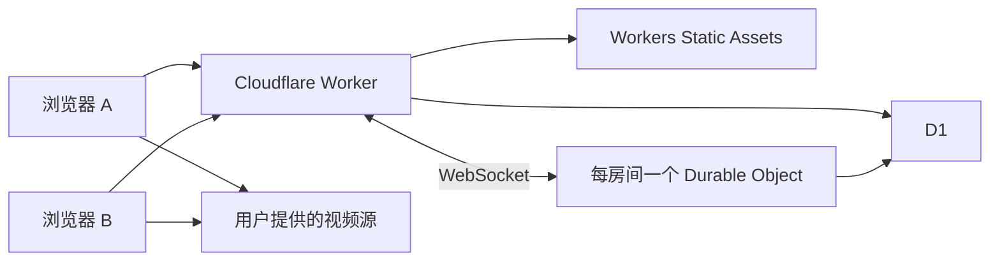

# OpenTogetherTube Cloudflare 预览版

`cloudflare-preview-0.1.1` 复用 cn8 的 Vue 播放器，将房间服务改写为 Cloudflare 原生运行方式。
部署目标是独立 Worker `ott-edge-preview`，不依赖腾讯云、Cloudflare Tunnel、Node.js 常驻进程、
Redis、PostgreSQL 或 `ffprobe`。保留在仓库中的原 `server/` 不参与此 Worker 构建。

## 架构

| 部分 | Cloudflare 服务 | 保存或处理的内容 |
| --- | --- | --- |
| 页面及静态资源 | Workers Static Assets | `client/dist`，包含对应版本源码下载包 |
| HTTP API | Workers | 访客身份、房间创建和发现、媒体元信息读取 |
| 每个房间 | SQLite Durable Objects | WebSocket 同步、权限、播放时钟、队列、快照及定时任务 |
| 跨房间索引 | D1 | 访客令牌摘要、房间索引、媒体元信息缓存和限流计数 |
| 后台清理 | 单个 SQLite Durable Object | 用 alarm 每 6 小时清理过期记录，不占用账户 Cron 配额 |



Durable Object 是房间状态的唯一权威来源，D1 只保存可查询的房间摘要。
删除房间后重新使用同名会创建新的对象实例，不会恢复旧房主或旧队列。
WebSocket 使用休眠接口；播放结束、临时倍速到期、访客认证超时及临时房回收由 alarm 驱动。
播放期间约每 30 秒保存一次时钟检查点，状态变更会立即保存。完整运行时重启可以恢复队列和位置；
空房暂停后，重新进入的首位有播放权限观众确认本机画面准备完成才继续播放。

首个 API 请求会在后台启动维护对象的持久化 alarm；首次清理约在 1 秒后，此后每 6 小时执行。
失败后 1 分钟重试，临时房索引清理每批最多 20 个，存在积压时继续分批运行。
维护对象在没有访问流量时仍能按 alarm 调度，不需要外部定时器。

视频数据由浏览器从原片源读取，Worker 只读取有上限的元信息。应用不提供视频上传、转码、
片源代理或破解防盗链。HTTPS 站点应使用浏览器能访问且允许本站播放的 HTTPS 视频链接；
HLS、DASH、自定义媒体 JSON 和字幕还需要片源正确设置跨域响应。

## 已实现与当前限制

- 公开或不公开的临时房、永久房，浏览房间、查看本人房间、删除本人房间。
- 创建者自动成为房主；支持改昵称、房间权限、角色管理和踢人。
- MP4/M4V/M4A、M3U8、MPD 和自定义媒体 JSON 直链；预览版不提供平台搜索或 YouTube 等平台解析。
- 双向同步播放/暂停、跳转、倍速、长按临时倍速、聊天、队列增删排序、投票及循环播放。
- 永久房保存当前视频、位置和待播队列；最后一人离开后暂停，手动暂停的房间重进仍保持暂停。
- 临时房默认连续空闲 300 秒后清除，`ROOM_IDLE_SECONDS` 可调整。临时房不用于长期收藏。
- 身份属于当前浏览器，令牌有效期 30 天，访问时按需续期。清除站点数据、换浏览器或长期未访问后
  可能失去房主权限。暂不支持账号登录、身份恢复、跨浏览器账号同步或旧实例用户/房间导入。
- 暂不支持 DJ 模式、SponsorBlock、撤销操作和手动选择队列恢复方式；相关入口在预览构建中隐藏。

每个身份最多保留 20 个房间，每房最多 100 个 WebSocket 连接、每身份每房 4 个连接。
队列最多 200 项且元信息总量不超过 512 KiB，单条 HTTP/WS 消息上限 64 KiB。
一次媒体解析（批量添加共用）最多读取 2 MiB、16 次请求（包括重定向），总期限 20 秒；
单个 MP4 索引过大、不支持所需 Range 或无有效时长时会返回错误，不会下载整段视频。
媒体缓存有效期 30 分钟。需要使用 Cloudflare 账户可用的 Workers、D1 和 SQLite Durable Objects 配额。

## 本地开发

以下命令在仓库根目录运行，推荐 Node.js 24，使用仓库自带的 Yarn 4.1.0。
首次安装会包含其他工作区的依赖，但启动此版本无需运行原服务端。

```sh
node .yarn/releases/yarn-4.1.0.cjs install --immutable
node .yarn/releases/yarn-4.1.0.cjs workspace ott-common build
node .yarn/releases/yarn-4.1.0.cjs workspace ott-edge build:client
node .yarn/releases/yarn-4.1.0.cjs workspace ott-edge db:local
node .yarn/releases/yarn-4.1.0.cjs workspace ott-edge dev
```

访问 `http://127.0.0.1:18787`。本地 Wrangler 使用独立的 `.wrangler` 数据；这些数据不会上传至 D1。
修改 Worker 后 Wrangler 自动重载；修改 Vue 后重新运行 `build:client`。本地 build 不自动生成源码包，
需要验证源码链接时按发布步骤生成归档。`wrangler.jsonc` 中的全零 D1 ID 只用于模板和本地开发。

## 发布独立 Cloudflare 预览站

OAuth 首次授权需要读取账户、写入 Workers 和 D1 的权限。Wrangler 登录配置留在用户配置目录，
不写入仓库。部署使用 Git 忽略的 `wrangler.preview.jsonc` 存放当前账户与数据库绑定。

首次配置：

```sh
node .yarn/releases/yarn-4.1.0.cjs workspace ott-edge exec wrangler login --scopes account:read user:read workers_scripts:write d1:write
cp packages/ott-edge/wrangler.jsonc packages/ott-edge/wrangler.preview.jsonc
node .yarn/releases/yarn-4.1.0.cjs workspace ott-edge exec wrangler d1 create ott-edge-preview --location apac
```

在 `wrangler.preview.jsonc` 填入 `account_id` 与创建命令返回的 `database_id`。
Worker 名称、数据库名称和 `OTT_INSTANCE_ID` 应与这个独立实例保持一致；已有数据库时复用其 ID，
不要再次创建。配置不包含生产域名的 routes，不需要修改 DNS、Tunnel 或腾讯云容器。

发布前执行检查，审查并提交所有准备发布的源码，确保工作区与 `HEAD` 一致，再构建与归档：

```sh
node .yarn/releases/yarn-4.1.0.cjs workspace ott-edge lint-ci
node .yarn/releases/yarn-4.1.0.cjs workspace ott-edge test
node .yarn/releases/yarn-4.1.0.cjs workspace ott-client lint-ci
node .yarn/releases/yarn-4.1.0.cjs workspace ott-client test
node .yarn/releases/yarn-4.1.0.cjs workspace ott-edge build:client
git archive --format=tar.gz --output=client/dist/source-code.tar.gz HEAD
node .yarn/releases/yarn-4.1.0.cjs workspace ott-edge db:remote
node .yarn/releases/yarn-4.1.0.cjs workspace ott-edge deploy:preview
```

Wrangler 返回 `https://ott-edge-preview.<账户子域>.workers.dev`。前端通过同源 `/api/` 访问 Worker，
不配置腾讯云 API 地址。`build:client` 与 Worker 的 `OTT_CLIENT_REVISION` 当前都使用
`cloudflare-preview-0.1.1`；每次发布新代码须同时更新两处值，供已打开的页面检测新版本。

源码归档必须在前端构建之后生成，因为构建会清空 `client/dist`。
`git archive` 包含已提交的前端、Worker、公共模块、迁移、构建配置和锁文件，保留 AGPL 许可证；
不包含 Git 历史、OAuth 凭证、私有部署配置、数据库、依赖目录或本地验收记录。
源码包在 `/source-code.tar.gz` 公开提供，页面上的源码入口指向该包。
禁止把整个工作目录打包后直接公开。

更新继续使用同一 Worker、D1 和 Durable Objects 绑定。保存 Wrangler 的部署版本 ID 便于回退；
有 schema 变化时先确认旧 Worker 是否兼容，Worker 版本回退不会回退数据库数据或迁移。

## 验证范围

`ott-edge test` 会先生成独立测试 Worker，再在真实本地 workerd、D1、SQLite Durable Objects 和
WebSocket 上执行集成测试，片源响应使用可控 fixture。覆盖权限、并发创建、元信息解析边界、
慢片源期间控制响应、双人同步、自动下一条、休眠、空房重入、临时房到期、后台清理及完整运行时重启。
这些测试不等于浏览器已经成功解码远程视频。

线上验收应检查健康接口、版本、SPA 深链接、静态资源及源码下载，并使用两个不同访客身份验证
HTTPS API、WSS 同步、队列、权限、聊天、断线重连与空房恢复；测试房间使用独立名称并在结束时删除。
片源示例：`https://vjs.zencdn.net/v/oceans.mp4`。

本轮环境的内置浏览器和隔离 Chromium 启动受到沙箱限制，尚未完成真实浏览器画面、视频解码、
手机全屏与自动播放策略验收。现有前端组件测试、workerd 测试及 WSS 客户端的准备完成消息
不能替代这些检查；发布结果应区分这些证据。
